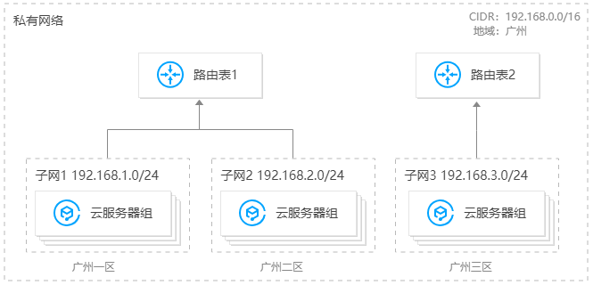
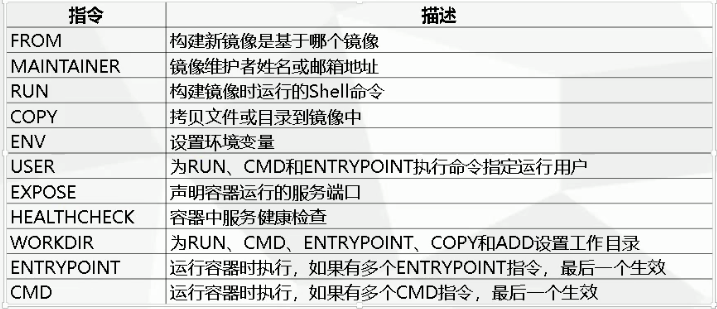

# 1 腾讯云相关
## 1.1 VPC——创建集群之前需要先创建私有网络空间
私有网络概念介绍：[https://cloud.tencent.com/document/product/215/20046](https://cloud.tencent.com/document/product/215/20046)

VPC(visual private cloud)的三大部分：私有网络网段、子网和路由表

可以将VPC类比为一个局域网，子网就是局域网下的子网，路由表一般由腾讯云自动生成，用于不同子网打通。详见下图：

## 1.2 集群网络与容器网络
容器网络与集群网络的关系

集群网络：为集群内主机分配在节点网络地址范围内的IP地址，选择私有网络VPC下的子网用于集群的节点网络.

容器网络：为集群内容器分配在容器网络地址范围内的IP地址，包含 GlobalRouter 模式和 VPC-CNI 模式。

GlobalRouter 模式：可以自定义三大私有网段作为容器网络，根据选择的集群内服务数量的上限，自动分配适当大小的 CIDR 段用于 Kubernetes

service。也可以根据选择的每个节点的 Pod 数量上限，自动为集群内每台云服务器分配一个适当大小的网段用于该主机分配 Pod 的 IP 地址。

VPC-CNI 模式：选择与集群同 VPC 的子网用于容器分配 IP。

容器网络与集群网络的限制：集群网络和容器网络网段不能重叠；同一VPC内，不同集群的容器网络网段不能重叠。容器网络和 VPC 路由重叠时，优先在容器网络内转发。
## 1.3 devops(基于腾讯云TKE+github actions)
### 1.3.1 创建集群
在腾讯云下依据模板创建K8s集群很简单，点点点，详见腾讯云用户文档 写的很清楚了https://cloud.tencent.com/document/product/457/32189

具体的创建步骤见第三节实践部分,本节侧重介绍其中的背景知识部分，即K8s的两大配置文件devlopment.yml和service.yml

利用模板创建完成后会自动生成devlopment.yml文件和service.yml文件，需要能看懂其中的配置项，这样有定制化的运维需求时直接修改对应文件的配置项即可

为不影响本文的观感，请移步

[devlopment.yml文件示例及注释](../script/devlopment.yml.md)

[service.yml文件示例及注释](../script/service.yml.md)
### 1.3.2 githubAction
阮一峰：githubAction相关的基础概念

https://www.ruanyifeng.com/blog/2019/09/getting-started-with-github-actions.html 

实践搭建：tke+githubAction

参考csdn文章 https://blog.csdn.net/weixin_41262316/article/details/109583803

# 2 项目构建
## 2.1 makefile
makefile简易教程

https://www.cnblogs.com/owlman/p/5514724.html

[makefile练手](../script/makefile.md)
## 2.2 CMakeList
基本的已经掌握了 暂时在这里不写了,之后再补充（TODO）
## 2.3 dockerfile


[dockerfile练手](../script/dockerfile.md)

需要注意的是 上面例子中的dockerfile在生成镜像的时候 编译时间实在太长（需要拉boost库+其他各种库+各种工具+编译）

笔者的做法是先在跳板机上执行make 生成编译后的可执行文件，再将可执行文件和各种库的依赖打包成镜像，这样速度会快很多

但缺点也很明显，当代码修改后需要重复执行上面的动作，发布的时候没有做到一键发布

之后有时间再来看这个镜像编译时间过长的问题有没有更好的处理方法（TODO）

# 3 集群部署实践
以笔者部署一个 基于RPC框架的后台服务为例，网络拓扑如下：


用了8台2核2G的CVM做node，后续为了做框架的性能压测又用了2台4核8G的CVM，按小时计费，每小时2块，一天就将近50块钱，腾讯云卖虚拟机还是有点贵的啊，花的我肉疼。。
## 3.1 创建VPC+子网
)
## 3.2 创建私有镜像仓库

## 3.3 创建namespace+service+workload
点点点 详情可以找腾讯云的文档 很简单 service-pod搭建结果如下


其中自动生成的yml文件关键部分截取如下：
```
# service.yml
apiVersion: v1
kind: Service
spec:
  clusterIP: 10.3.252.62
  ports:
  - name: 7749-7749-tcp
  selector:
    k8s-app: teacher-server-service
    qcloud-app: teacher-server-service
  type: ClusterIP

# deployment.yml
apiVersion: apps/v1
kind: Deployment
template:
spec:
      containers:
        env:
        image: ccr.ccs.tencentyun.com/rpc-hub/rush-rpc:1.1.2
        imagePullPolicy: Always
        name: teacher-server
        # command这行后续配置进去的
        # 防止进程结束后容器不断自重启
        command: ["/bin/bash", "-ce", "tail -f /dev/null"]
        resources:
          limits:
            cpu: "2"
            memory: 2Gi
          requests:
            cpu: "1"
            memory: 1Gi
```
## 3.4 后台业务依赖组件部署
介绍mysql+redis+etcd的安装和初始化
### 3.4.1 mysql
**安装**
```
sudo apt-get update  				//更新软件源
sudo apt-get install mysql-server  //安装mysql
sudo apt-get install libmysqlclient-dev
编译链接命令
gcc -o mysql Mysql.c -I /usr/include/mysql/ -lmysqlclient
```
**修改配置文件**
```
vim /etc/mysql/mysql.conf.d/mysqld.cnf
# 注释掉下面这行，默认是本地数据库，需要注释掉
#bind 127.0.0.1 
# 重启服务
service mysql restart
```
**改密码**
```
sudo cat /etc/mysql/debian.cnf
mysql -u debian-sys-maint -p
use mysql
update mysql.user set authentication_string=password('123456') where user='root' and Host ='localhost';
update user set  plugin="mysql_native_password";
flush privileges;
```
**修改权限表（以允许外部主机链接至mysql）**
```
select host,user from user;
update user set host='%' where user='root';
select host,user from user;
flush privileges;
quit;
```
****
**建表并初始化**
```
mysql -u root -p
123456
CREATE DATABASE usr;
use usr
mysql> create table teacher(
    -> id int(11) not null auto_increment,
    -> name varchar(80) not null,
    -> school varchar(80) not null,
    -> grade int(11) not null,
    -> subject varchar(80) not null,
    -> primary key(id)
    -> )ENGINE=InnoDB DEFAULT
    -> CHARSET=gb2312;
mysql> insert into teacher(id,name,school,grade,subject) values('1','teacher1','school1','1','math');
mysql> insert into teacher(id,name,school,grade,subject) values('2','teacher2','school2','4','english');
mysql> insert into teacher(id,name,school,grade,subject) values('3','teacher3','school3','9','physics');
select * from teacher;
```
建表结果：


### 3.4.2 redis
**redis安装并启动**
```
sudo apt-get install redis-server
```
**初始化配置文件并重启**
```
sudo vi /etc/redis/redis.conf
# 注释掉绑定地址
#bind 127.0.0.1
#关闭保护模式 否则会拒绝外部ip访问
protected-mode no 
# 查看状态
sudo /etc/init.d/redis-server status
# 重启服务
sudo /etc/init.d/redis-server restart
```
### 3.4.3 etcd三节点集群搭建
node1
172.16.3.13
node2
172.16.3.16
node3
172.16.3.5

**安装**
```
apt-get -y install etcd
```
**etcd配置信息**
```
vim /etc/etcd/etcd.conf
ETCD_NAME="node1"
ETCD_DATA_DIR="/var/lib/etcd"
ETCD_LISTEN_PEER_URLS="http://172.16.3.13:2380"
ETCD_LISTEN_CLIENT_URLS="http://0.0.0.0:2379"
ETCD_INITIAL_ADVERTISE_PEER_URLS="http://172.16.3.13:2380"
ETCD_INITIAL_CLUSTER="node1=http://172.16.3.13:2380,node2=http://172.16.3.16:2380,node3=http://172.16.3.5:2380"
ETCD_INITIAL_CLUSTER_TOKEN="my-etcd-cluster"
ETCD_ADVERTISE_CLIENT_URLS="http://0.0.0.0:2379"
```

**etcd 常用命令**
```
# 启动
systemctl daemon-reload && systemctl enable etcd && systemctl start etcd
# 查看集群状态
etcdctl member list 
etcdctl cluster-health
# 重启
## 1关闭所有etcd
systemctl stop etcd 
## 2删除所有 etcd 节点中 ETCD_DATA_DIR 配置目录下的内容，我这里是
ETCD_DATA_DIR="/var/lib/etcd/default.etcd"
## 3启动所有etcd: 
systemctl start etcd
```
etcd三节点集群搭建结果：


## 3.5 镜像部署过程
**在跳板机上先本地生成docker镜像**

创建dockerfile

为防止镜像程序意外退出，导致pod一直重启，可以在deployment.yml中添加

command: ["/bin/bash", "-ce", "tail -f /dev/null"]

也可以在dockerfile文件的CMD添加.sh脚本，将启动命令写入脚本中 CMD["*.sh"]，在脚本的最后执行 tail -f /dev/null

dockerfile
```
FROM ubuntu
# 添加可执行文件及依赖
COPY . /home/
# 切换工作目录
WORKDIR /home/ubuntu
# 暴露端口
EXPOSE 7749
CMD ["start.sh"]
```

start.sh
将一些运维的命令打包成脚本
```
#!/bin/bash
# 添加so文件搜索路径
# rush-rpc.conf是一起打包过来的配置文件 内容是 /home/ubuntu
cp rush-rpc.conf /etc/ld.so.conf.d/
# 刷新
sudo ldconfig
# 启动
# TODO:将程序启动加入进来（需要写脚本的入参和启动状态判断）./rpc_server -t 2 -h 10.x.x.x -p 7749
tail -f /dev/null
```

**生成镜像并发布**
```
sudo docker build -f dockerfile -t teacher_server:1.0.0 . 
# 发布到腾讯云镜像仓库
docker login ccr.ccs.tencentyun.com --username=xxxxxx
docker tag [imageId] ccr.ccs.tencentyun.com/rpc-hub/rush-rpc:[tag]
docker push ccr.ccs.tencentyun.com/rpc-hub/rush-rpc:[tag]
```

**部署镜像**
两种方式：

在K8s生成pod时会自动拉取镜像，在development填好镜像信息即可

还可以主动拉取：

```
# 主动拉取镜像
docker pull ccr.ccs.tencentyun.com/rpc-hub/rush-rpc:[tag]
```


这样就实现了镜像部署，代替传统的部署方式，比如使用scp或使用ssh rz sz的方式传文件
```
# linux下两台主机复制文件
scp -r  admin@192.168.219.125:/home/admin/test  /home/admin/
sudo scp ubuntu@101.33.247.88:/home/ubuntu/RPC-K8S-githubAction_cicd_test/src/rpc_server_edu_test .
```