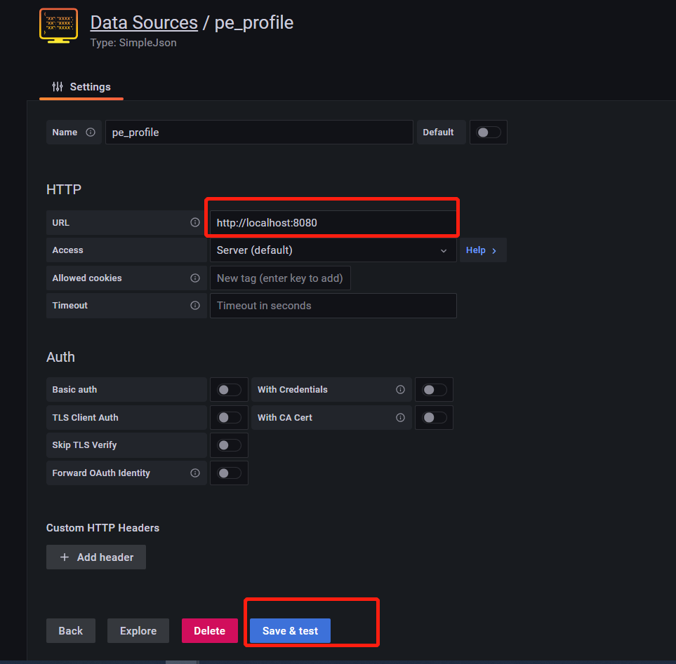
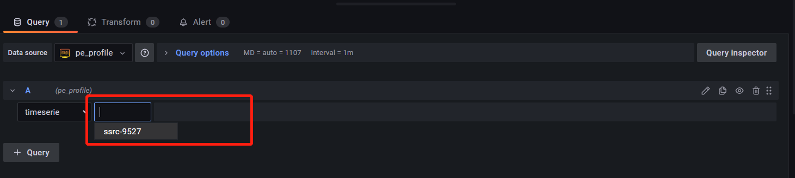
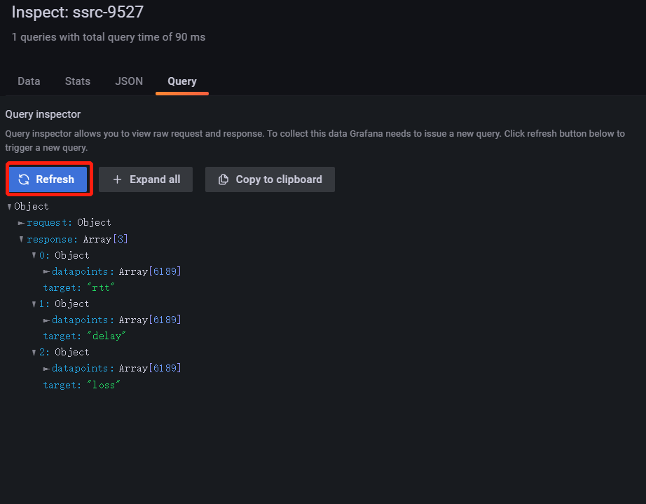

# 前言
tsdb实现之后，需要接入监控告警系统，利用grafana实现

自定义数据源接入 grafana需要利用simaplejson插件实现

接下来是grafana接入的step by step 实践

# grafana安装 启动 访问
```
# 下载
wget https://dl.grafana.com/enterprise/release/grafana-enterprise-8.1.2-1.x86_64.rpm
# 安装
yum install grafana-enterprise-8.1.2-1.x86_64.rpm
# 启动
systemctl enable grafana-server
systemctl start grafana-server
systemctl status grafana-server
netstat -anplut | grep grafana
# 重启
systemctl restart grafana-server
```
本机访问 
http://localhost:3000
admin/admin

# simplejson 安装
```
grafana-cli plugins install simpod-json-datasource
```
安装之后，在datasource->new 中就可以选择simaplejson类型数据源

# 实现grafana-server
自定义数据源接入grafana，需要拉起http-server响应grafana前端的查询请求，并实现要求的三个基本接口，直接上代码

利用libhv 实现语言是C++

```
  hv::HttpService service;

  service.GET("/", [](HttpRequest* req, HttpResponse* resp) {
    return 200;
  });

  service.POST("/search", [](const HttpContextPtr& ctx) {
    std::string str = "[\"ssrc-9527\"]";
    return ctx->send(str, ctx->type());
  });

  service.POST("/query", [](const HttpContextPtr& ctx) {
    xc_string_t *res;
    res = tsdb_search("ssrc-9527.000000", 0, LLONG_MAX);
    std::string str = res->cstr;
    return ctx->send(str, ctx->type());
  });

  http_server_t server;
  server.port = 8080;
  server.service = &service;
  http_server_run(&server);

```

# 配置报表
**配置数据源：**

点击红框save&test 会请求上面实现的grafana-server的 "/"接口
返回200 则配置数据源成功



**选择指标：**

点击红框 会调用 "/search"
返回的数据会出现在下拉框中备选



**查询数据**

上一步选择指标完成，或点击query中的refresh 会自动调用"/query"接口
在该接口中调用tsdb的查询接口，并将返回的数据格式化为grafana simlpejson插件要求的object数组

