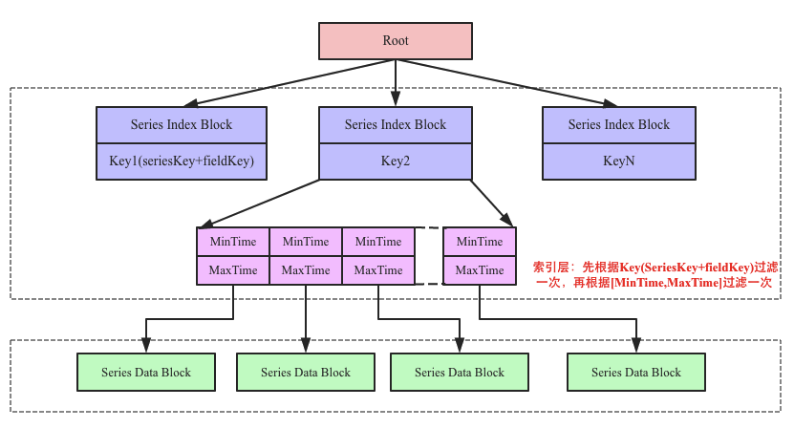

# 1 数据存储
## 1.1 基本思路

```
  │                 │
Read              Write
  │                 │
  │                 V
  │      ┌───────────────────┐ 
  ├─────>   Memory   chunk
  │      └───────────────────┘
  │				   │
  │      ┌─────────V─────────┐
  ├─────>   Disk 	 File
  │      └───────────────────┘ 
  │
  │      ┌───────────────────┐
  └─────>   Disk 	File
         └───────────────────┘
```

批量追加写
延时写以实现批量写，数据先写入mem chunk

保证顺序写
保证只有一个文件可写，避免每次写入少量数据到多个文件的随机写而造成的SSD写放大
## 1.2 存储格式
**文件系统**
文件名是文件创建时间
data文件保存数据点point 固定为2GB
meta.json保存数据点的索引

```
$ tree ./pprofile
./pprofile
├── 1652776817210
│   ├── data
│   └── meta.json
├── 1652787792719
│   ├── data
│   └── meta.json
└── 1652753577002
    ├── data
    └── meta.json
```
存储格式：
```
{
       "minTimestamp": 1600000001,
       "maxTimestamp": 1600000600,
       "numDataPoints": 131072,
       "ssrc-1234": {
         "rtt":{ 
            {
            "name": "rtt",                                  
            "offset": 0,         -------------0--->┌────────────┬───────────────────┬───────────┬───────────────┐
            "size":256;                     	   │  field_1   │      field_2      │  field_3  │      field_4  │---->chunk1
            "minTimestamp": 1600000001,     	   └────────────┴───────────────────┴───────────┴───────────────┘
            "maxTimestamp": 1600001201,      ----> │  field_1   │      field_2      │  field_3  │      field_4  │---->chunk2
            "numDataPoints": 16             │      └────────────┴───────────────────┴───────────┴───────────────┘
            },                              │      │  field_1   │      field_2      │  field_3  │      field_4  │---->chunk3
            {                               │      └────────────┴───────────────────┴───────────┴───────────────┘
            "name": "rtt",                  │
            "offset": 13231,-----------------
            "size":273,
            "minTimestamp": 1600000121,
            "maxTimestamp": 1600000321,
            "numDataPoints": 17
            },
          },
		  "delay":{}
		  "nerr":{}
        }
     }
```
# 2 数据查询设计
查询流程：

