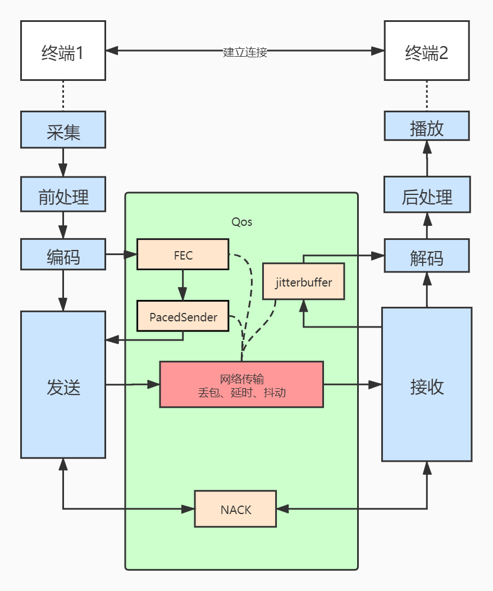

# webrtc大致流程

通信双方经过媒体协商，NAT打洞，协商密钥等过程建立了一条p2p连接，[详细建立连接过程](./WebRtc通信建立流程.md)。
发送端经过采集，前处理，编码等步骤将音视频数据打包成rtp包发送到对端，对端接收到rtp包后经历解码，后处理，而后播放。在这个流程中，目前主要分析了[webRtc音视频数据发送和接收流程](./webRtc音视频数据接收发送流程.md)，以及其中涉及到的几种[Qos方法](./webRtc中的Qos方法.md)，比如NACK模块丢包重发，pacedSender平滑发送方法。