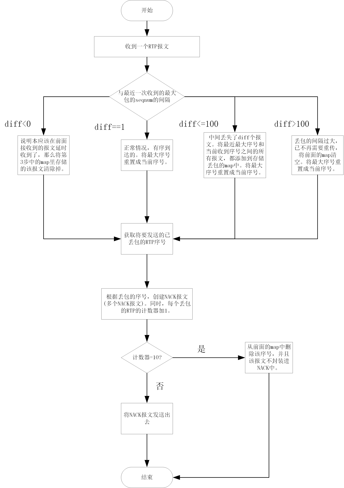
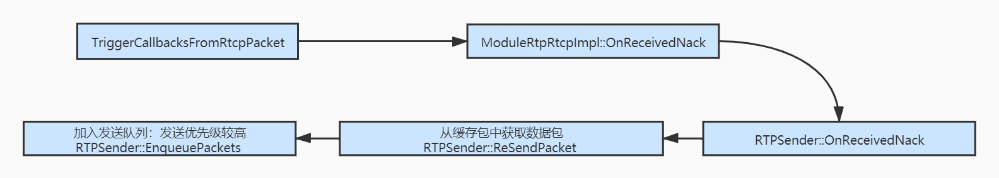

https://www.jianshu.com/p/6413cf2e8aca 丢包重传原理
# NACK
## Nack模块相关数据结构
nack_list用于记录丢包信息 seq->nackInfo

keyframe_list_ 用于记录每次回调OnReceiverPacket的关键帧 

recover_list用于记录每次回调的RTX和FEC恢复包

## Nack Receiver端触发流程

首次接包 把seq更新为newest_seq_num_ 如果seq是关键帧的话插入keyframe_list 直接return
ahead()判断last是否在seq之前 若是则乱序 是重传包 在nack_list中删除之 并且更新keyframe_list和recover_list 返回该恢复包请求重传或恢复的次数 若否 则是丢包 在nack_list插入中间丢失的包的seq（AddPacketsToNack中间有请求关键帧的步骤 RemovePacketsUntilKeyFrame合理请求I帧恰好能缓解丢包极其严重的问题？？）
发送重传信息：GetNackBatch得到的nack_list不空则是有丢包的情况 直接发起send 同时重传的包也有可能丢所以配合定时任务RepeatedTaskHandle 每20ms重复发送NACK请求

## Nack Sender重传流程图

若不使用PacesSender则RTPSedner::PrepareAndSendPacket进行立即重发，如果是使用 PacedSend, 则使用 PacedSender::InsertPacket 先加入发送列表中, 它的process会定时处理发送任务.
# pacedSender
一帧音频数据本身不大，不会超过以太网的最大报文长度。一个RTP报文可以搞定，按照打包时长的节奏发送就可以。但视频数据不能按照音频数据的思路发送，一帧视频可能很大，远大于以太网的1500byte，需要分别封装在几个RTP报文中，若这些视频帧RTP报文一起发送到网络上，必然会导致网络瞬间拥塞。产生丢包抖动等异常。
## 入队
PacedSender::EnqueuePacket函数-->PacedSender::EnqueuePacket按照优先级入队RoundRobinPacketQueue 多维优先级链表
RoundRobinPacketQueue链表结构？？
## 出队
### 发送优先级确定
音视频数据编码和RTP切分打包后，首先将RTP报文存在pace queue队列，并将报文元数据(packet id, size, timestamp, 重传标示)送到pacer queue进行排队等待发送，可能的包类型有，音频，视频、NACK、FEC，PADDING。pace queue是一个优先级链表，报文的优先级由一个函数确认GetPriorityForType，重传报文>音视频报文,视频帧由timestamp标识，越早由下级越高
## 发送时间间隔确定
发送时间间隔由函数PacingController::NextSendTime控制，有两种模式kPeriodic、kDynamic，当时间到达时就会调用PacingController::ProcessPackets发包，其中kPeriodic时固定5ms发包 kDynamic？？
mode_ == ProcessMode::kPeriodic 
min_packet_limit_

## 每个发送时发送字节的确定
这个涉及到一些动态码率估计算法，当Pacing::ProcessPackets被触发时，会计算与上次法宝的时间差delta_time然后传入media_buget_，由media_buget_确认还可以发多少，确认的公式是：
remain bytes = delta_time * tareget_bitrate(pacer的参考码率)/8
其中tareget_bitrate是由estimator由网络状态评估的