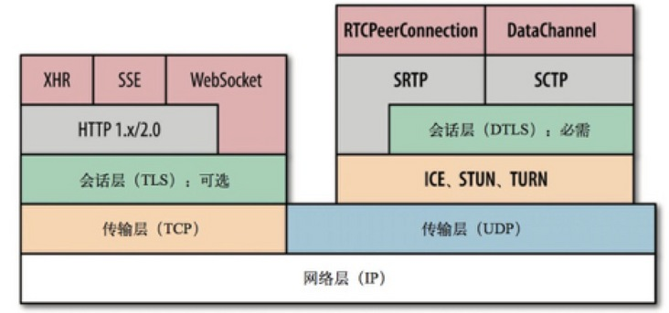

# 1 前言
WebRTC在信令传输采用了可靠的TCP，但是音视频数据传输上，使用了效率高的UDP作为传输层协议。而在UDP的使用过程常出现丢包和乱序等问题，为了保障音视频通讯的相对可靠性，需要在应用层使用RTP协议实现，在此基础上SRTP使用dtls加密数据,防止数据被窃取。此外，对于其他数据的传输，webrtc使用的是SCTP协议。可以参考下面这张图：

## 2 RTP Real-timeTransportProtocol (实时传输协议)
### 2.1 RTP
RTP主要提供的能力有：实时数据的端到端传输,序号（用于丢包和重排序检）,时间戳（时间同步校对和分发监控）,载荷的定义类型（用于说明数据的编码格式）,但不包括：及时发送,质量保证,送达（可能丢）,时序（到达顺序）

**RTP报文：**

RTP报文由两部分组成：报头和有效载荷
以下为RTP协议头的解释，前12字节是固定的，CSRC可以有多个或者0个。

V：RTP协议的版本号，占2位，当前协议版本号为2

P：填充标志，占1位，如果P=1，则在该报文的尾部填充一个或多个额外的八位组，它们不是有效载荷的一部分。

X：扩展标志，占1位，如果X=1，则在RTP报头后跟有一个扩展报头。

CC：CSRC计数器，占4位，指示CSRC标识符个数

M：标志，占1位，不同的有效载荷有不同的含义，对于视频，标记一帧的结束；对于音频，标记会话的开始。

PT（payload type）：有效荷载类型，占7位，用于记录RTP报文中有效载荷的类型/Codec，在流媒体中大部分是用来区分音频流和视频流，便于接收端（receiver）找出相应的 decoder 解碼出來。

序列号（sequence number）：占16位，__用于标识发送者所发送的RTP报文的序列号，每发送一个报文，序列号增1。__ 这个字段当下层的承载协议用UDP的时候，网络状况不好的时候可以用来检查丢包。当出现网络抖动的情况可以用来对数据进行重新排序。序列号的初始值是随机的，同时音频包和视频包的sequence是分别计数的。

时戳（timestamp）：占32位，必须使用90kHZ时钟频率（程序中的90000）。时戳反映了该RTP报文的第一个八位组的采样时刻。接受者使用时戳来计算延迟和延迟抖动，并进行同步控制。可以根据RTP包的时间戳来获得数据包的时序。

同步源（SSRC）标识符：占32位，用于标识同步信源。同步信源是指产生媒体流的信源，他通过RTP报头中的一个32为数字SSRC标识符来标识，而不依赖网络地址，接收者将根据SSRC标识符来区分不同的信源，进行RTP报文的分组。

贡献源（CSRC）标识符：每个CSRC标识符占32位，可以有0~15个CSRC。每个CSRC标识了包含在RTP报文有效载荷中的所有提供信源。

### 2.2 RTCP （Real-timeControlProtocol 实时传输控制协议）
正如上面所说，RTP不能保证即时发送和质量。

RTCP用来监控网络服务质量，会在传输时实时告知对方网络质量（如丢包，乱序，抖动等），这样webrtc就可以根据网络情况来调整传输策略了.

RTCP协议：

首先RTCP报文有多种类型，重点关注：

发送报告SR (Sender Report): 当前活动发送者发送、接收统计。

接受者报告RR (Reciver Report)：接收报告，非活动发送者接收统计。

SR的协议规范：

Header 部分用于标识该报文的类型，比如是 SR（200） 还是 RR（201）。

Sender info 部分用于指明作为发送方，到底发了多少包。

Report block 部分指明发送方作为接收方时，它从各个 SSRC 接收包的情况

### 2.3 会话流程
当应用建立一个RTP会话时，应用程序将确定一对目的传输地址。目的传输地址由一个网络地址和一对端口组成，有两个端口：一个给RTP包，一个给RTCP包。RTP数据发向偶数的UDP端口，而对应的控制信号RTCP数据发向相邻的奇数UDP端口（偶数的UDP端口＋1），这样就构成一个UDP端口对。大致流程如下：

RTP协议从上层接收流媒体信息码流，封装成RTP数据包；

RTCP从上层接收控制信息，封装成RTCP控制包。

RTP将RTP 数据包发往UDP端口对中偶数端口；RTCP将RTCP控制包发往UDP端口对中的接收端口。

# 3 SRTP
在RTP的基础上进行数据加密，类似与http+tls=https，在这是RTP+dtls=SRTP，dtls是基于udp的握手协议，协商密钥具体的握手过程可类比tls不再详细说明。

# 4 SCTP
webrtc传输其他数据用SCTP,自定义数据传输协议。具体可参考：http://km.oa.com/articles/show/355904?kmref=search&from_page=1&no=9

# 5 参考资料
http://km.oa.com/articles/show/355904?kmref=search&from_page=1&no=9
http://km.oa.com/group/29048/articles/show/405435