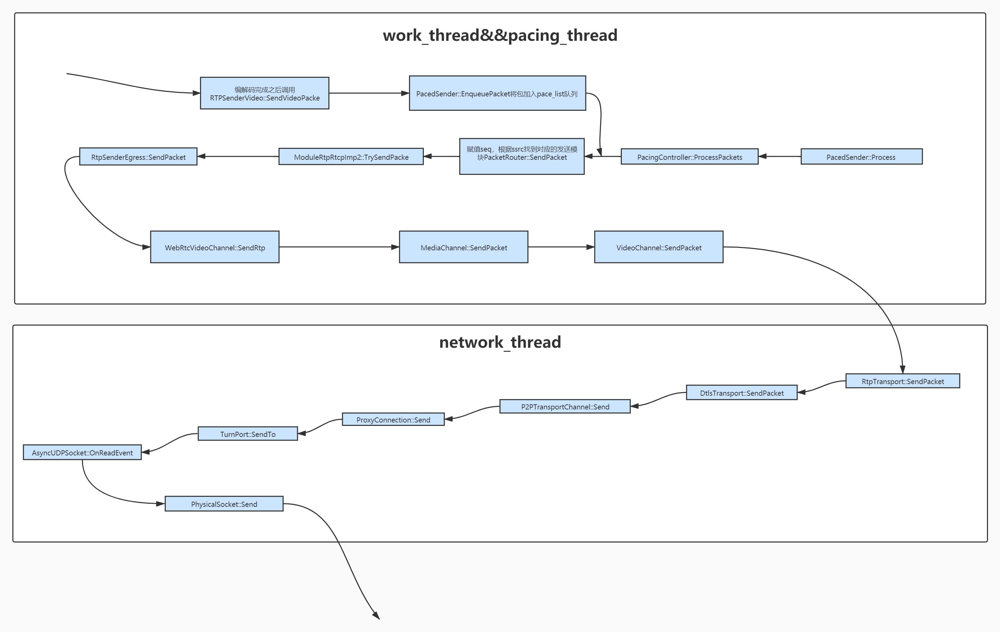

# 前言
p2p连接建立之后，底层的socket已经准备好，接收端要想接收数据，必须能够捕获socket相关的事件。在了解真正的接收流程前有必要先了解webrtc底层线程是如何对IO响应的。[线程模型](./webRtc线程模型.md)
# 视频接收流程

## 调用关系：QT信号和槽函数
1. connection->SignalReadPacket.connect(this, &P2PTransportChannel::OnReadPacket); 
2. P2PTransportChannel->SignalReadPacket.connect(this, &DtlsTransport::OnReadPacket);
3. DtlsTransport->SignalReadPacket.connect(this, &RtpTransport::OnReadPacket);
4. RtpDemuxer::OnRtpPacket-->VideoChannel：OnRtpPacket这一步的调用 底层是通过：
rtp_demuxer_.AddSink(rtp_demuxer_ x,VideoChannel y)
把VideoChannel作为Sink加到 RtpTransport里的 rtp_demuxer_实现的

## 容错处理
容错：利用h264编码规则对遍历payload中的NALU，看是否缺乏I帧，若缺乏I帧则请求重传
### 前置知识：h264编码格式以及视频帧的知识
GOP 及I P B帧
谓GOP，意思是画面组，MPEG格中的帧序列，分为I P B三种，如排成IBBPBBPBBPBBPBBP...样式，这种连续的帧图片组合即为GOP（画面群，GROUP OF PICTURE），是MPEG将来存取的最本基本的单位，它的排列顺序将会一直重复到影像结束。一个GOP就是一组连续的IPB画面。MPEG编码将画面（即帧）分为I、P、B三种，I是内部编码帧，P是前向预测帧，B是双向内插帧。简单地讲，I帧是一个完整的画面，而P帧和B帧记录的是相对于I帧的变化。

h264编码格式
h264分成两层 VAL和NAL VAL是视频压缩的一些算法，会将视频编码成VAL数据，NAL是网络适配层，负责将VCL的数据组织打包以达到更好网络传输效果
NAL的格式：NALU header + NALU payload
NALU header

| forbidden_zero_bit | nal_ref_idc | nal_unit_type |
|--------------------|-------------|---------------|
|        1 bit       |    2 bit    |    5 bit      |

forbidden_zero_bit 一般为0 为1表示包被丢弃
nal_ref_idc 表示当前NALU优先级 非0表示表示SPS PPS 帧等
nal_unit_type 表示NALU类型 主要有

|value|NALU内容|
|------|--------|
|1-4|I/P/B帧|
|5|IDR|
|7|SPS|
|8|PPS|

IDR帧 I帧的一种 标志着解码器可以刷新SPS和PPS了 如果该NALU为一帧的首个包，那么他的前两个NALU必然为SPS和PPS

SPS 序列参数集 中保存了一组编码视频序列(Coded Video Sequence)的全局参数。因此该类型保存的是和编码序列相关的参数。

PPS 图像参数集 该类型保存了整体图像相关的参数。

SPS PPS这两个参数是为了对抗含有图像头的包在传输丢失的情况

### 调用链
在OnReceivedPayloadData函数中通过调用h264编码器的CopyAndFixBitstream方法判断
当H264SpsPpsTracker::FixedBitstream H264SpsPpsTracker::CopyAndFixBitstream 返回kRequestKeyframe表明这个包的I帧有问题需要发起关键帧请求
请求链路：
RtpVideoStreamReceiver::RequestKeyFrame()方法 将request_key_frame变量设置为true
RtpVideoStreamReceiver::SendBufferedRtcpFeedback 该方法会判断是关键帧请求重传还是NACK模块请求重传，若是关键帧请求则调用ModuleRtpRtcpImpl::SendPictureLOssIndication()
## NACK
Nack分析见[./webRtc中的Qos方法](webRtc中的Qos方法.md)
# 视频发送流程

## pacedSender
pacedSender分析见[./webRtc中的Qos方法](webRtc中的Qos方法.md)