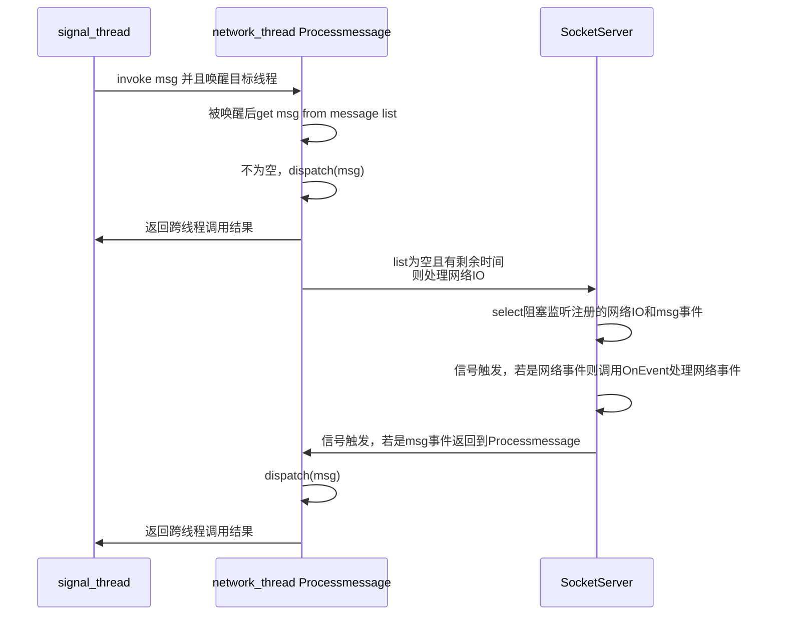
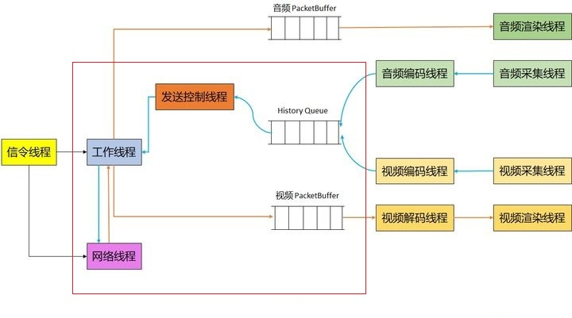

# 1 前言
在读源码过程中发现webrtc的各个线程有明确的分工，特定的函数一定要在指定的线程上执行，因此在webrtc运行中执行代码时，经常会遇到线程切换。为之后的学习做铺垫，需要了解下webRtc的线程模型。
# 2 各个线程有明确的分工
- 信令线程（Signal Thread）
一般是工作在 PeerConnection 层，主要是完成控制平面的逻辑，用于和应用层交互。比如，CreateOffer，SetRemoteSession 等接口都是通过 Signal thread 完成的。默认是采用 PeerConnectionFactory 初始化线程作为信令线程。
- 工作线程（Worker Thread）
主要是工作在媒体引擎层（media engine），具体工作如下:
音频设备初始化、视频设备初始化、流对象的初始化
从网络线程接收数据，传给解码器线程
从编码器线程接收数据，传给网络线程
- 网络线程（Network thread ）
主要是工作在传输（transport）层，具体工作如下：
Transport 的初始化
从网络接收数据，发送给 Worker thread
从 Worker thread 接收数据，发送到网络

# 3 线程模型
## 线程工作流程

可以看到线程阻塞在select，select除了会管理网络IO外，也会管理msg（一般是webrtc内部的跨线程调用），当msg事件被触发，socketServer会将线程控制权归还给Processmessage进行处理，而如果是网络IO，则会直接调用Onevent处理，这就是webrtc的线程模型，它解决了跨线程函数调用和管理网络IO的问题。
## 3.2 一个例子演示跨线程同步调用的过程

在当前signal_thread线程中创建dataChannel需要调用SeetupNataChannelTransport_n 而这个函数是要在network线程执行，因此需要进行跨线程调用，代码如下：

```
if(!network_thread())->Invoke<bool>){
    rtc:Bind(&PeerConnection::SeetupNataChannelTransport_n,this,mid)
}
```

**network_thread()是获取network线程的thread对象，注意这里的Invoke()函数是在sigal线程中执行的network线程对象的Invoke()函数。换言之在Invoke函数内的this指针是netword_thread对象，消息队列message_list也是network_thread对象的，而调用TheadManger的方法 CurrentThead()获取的则是singal线程的对象，以下的分析都是基于此的：**

重点关注network_thread对象的Invoke函数以及参数传递

跟踪Invoke调用 发现实际是调用的thread::Send函数，函数的流程以及对应线程的响应可以用流程图来表示，文字描述如下：

Invoke函数（InvokeInternal）:本质上就是将需要执行的方法封装到消息处理器FunctorMessageHandler中，然后执行send(来源线程，FunctorMessageHandler)

Send函数 把入参FunctorMessageHandler包装成msg信息，并且向network_thread线程的message_list投递（Post）msg和一些信号量（比如局部变量ready的引用，这里是用的lamda表达式传递的），并且调用wakeup（唤醒机制）唤醒network_thread线程，然后阻塞等待返回

network_thread线程有一个消息循环 ProcessMessages，线程被唤醒后，会调用Get函数检查其消息队列

Get函数 逻辑是取到一个消息就返回 优先取延时消息，再取即时消息，并且会计算超时时间（设置的超时时间和延时队列下一个时间触发的时间取最小值），在超时时间内，处理网络IO（SocketServer），取到一条消息就会返回true,并调用dispatch处理消息

dispatch(msg)会调用msg的OnMessage方法消费消息，并且置ready为true，结果返回值会层层上抛，返回给调用线程singal_thread，并且调用wakeUp唤醒它

singal_thread线程被唤醒之后会检查局部变量ready是否为true,若为true，则说明唤醒他的是目标线程而且是本次调用，从而函数调用返回

## 3.3 与线程切换相关的类
### ThreadManger
TheadManger是一个全局单例类，主要作用就是通过将一个内核线程与一个thread对象关联（将thread对象的地址存储在线程tls的某个槽位中），管理所有thread对象来管理所有线程。主要的方法有设置当前线程关联的thread对象,获取当前线程关联的thread对象等。

### TaskQueue
TaskQueue是thread类的父类，主要提供了PostTask、PostDelayedTask接口，使得thread类具有向消息队列投递即时消息和延时消息的能力，thread类在此基础上实现了Send,Invoke方法，实现了方法跨线程同步调用的功能。

# 4 webrtc 线程结构
webrtc规定了特定的线程执行特定的任务，所以一个线程就饿可以看成是一个单独的模块，分析线程之间的结构其实就是在分析webrtc整个的架构内部的架构，比如内部数据流向，各模块的边界和功能等等，这部分需要对webrtc的各个模块都有所了解之后才能把握，所以这里就先放一张网上找的图感性认识一下，详细的分析后续再补。


# 参考资料
https://zhuanlan.zhihu.com/p/136070941
https://zhuanlan.zhihu.com/p/25288799?from_voters_page=true