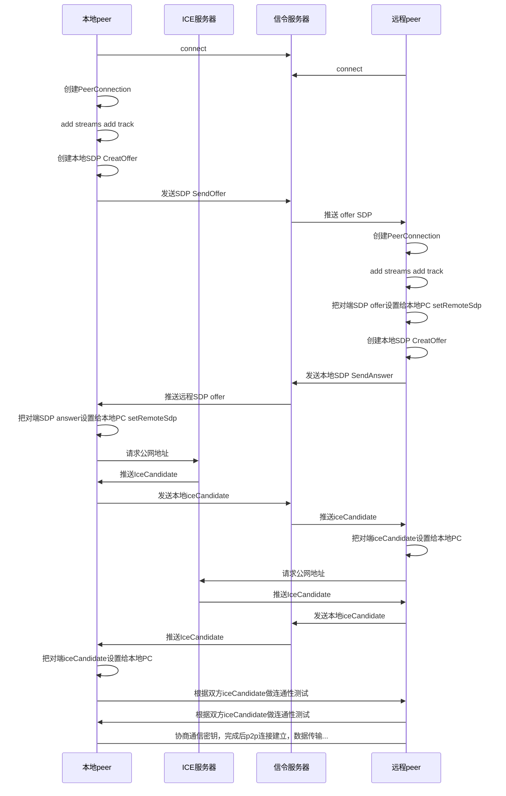

# 1 WebRtc通信建立时序图：

```mermaid
sequenceDiagram
participant local_peer as 本地peer
participant  ice_server as ICE服务器
participant signal_server as 信令服务器
participant remote_peer as 远程peer
local_peer ->> signal_server: connect
remote_peer ->> signal_server:connect
local_peer ->> local_peer:创建PeerConnection 
local_peer ->> local_peer:add streams add track
local_peer ->> local_peer:创建本地SDP CreatOffer
local_peer ->> signal_server: 发送SDP SendOffer
signal_server ->> remote_peer: 推送 offer SDP
remote_peer ->> remote_peer:创建PeerConnection 
remote_peer ->> remote_peer:add streams add track
remote_peer ->> remote_peer:把对端SDP offer设置给本地PC setRemoteSdp
remote_peer ->> remote_peer:创建本地SDP CreatOffer
remote_peer ->> signal_server:发送本地SDP SendAnswer
signal_server ->> local_peer:推送远程SDP offer
local_peer ->> local_peer:把对端SDP answer设置给本地PC setRemoteSdp
local_peer ->> ice_server:请求公网地址
ice_server ->> local_peer:推送IceCandidate
local_peer ->> signal_server:发送本地iceCandidate
signal_server ->> remote_peer:推送iceCandidate
remote_peer ->> remote_peer:把对端iceCandidate设置给本地PC
remote_peer ->> ice_server: 请求公网地址
ice_server ->> remote_peer: 推送IceCandidate
remote_peer ->> signal_server:发送本地iceCandidate
signal_server ->> local_peer: 推送IceCandidate
local_peer ->> local_peer:把对端iceCandidate设置给本地PC
local_peer ->> remote_peer:根据双方iceCandidate做连通性测试
remote_peer ->> local_peer:根据双方iceCandidate做连通性测试
local_peer -> remote_peer:协商通信密钥，完成后p2p连接建立，数据传输...
```

# 各步骤代码走读
## 创建PeerConnect