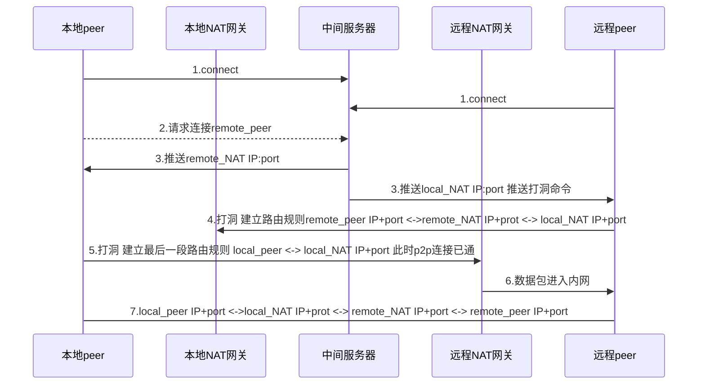
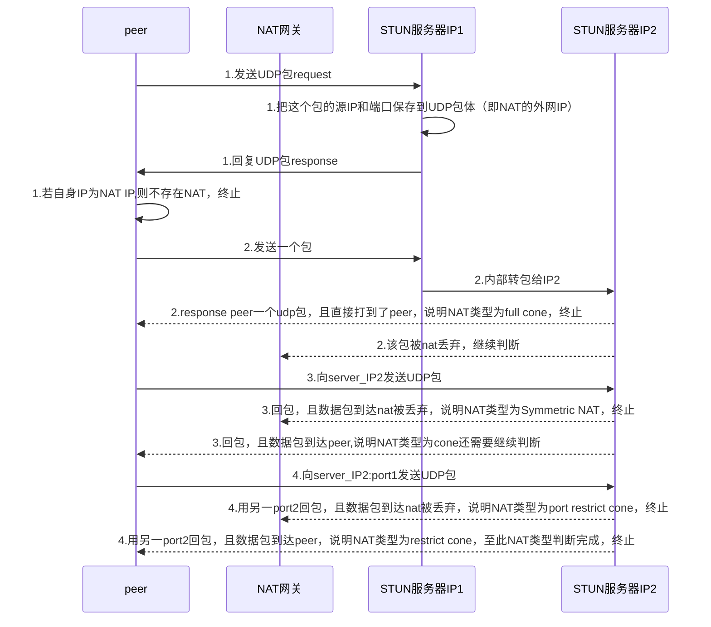

# 1 前言
传统的网络模型一般说的是CS模型中服务器的网络模型，比如多进程，多线程，Reactor+多路复用等等模式。这里音视频通讯的场景考虑到中心服务器的压力以及带宽等，多使用对等连接即p2p的方式，而多方通话的网络结构也是在此基础上产生的。所以这里的网络模型指的是整个网络的拓扑结构。
## 2 P2P通信 1对1
### 2.1 NAT穿透 NAT(Network Address Translators)，网络地址转换
- 不同局域网的两台机器无法直接通信，这是由于公网IP有限，内网机器都是由网关动态分配的私网IP,在外网无法进行ip路由。
- NAT网关
  * 作用：一般把内网的主机叫做是客户端，公网的主机叫做是服务器,就是常见的CS模式。数据包从一台内网机器发出后，会根据ip协议进行路由跳转，直到数据包到达NAT网关，NAT网关位于公网与内网之间，由于在内网ip是私有ip，公网的路由只能路由公网IP，所以数据包必须在NAT网关这里进行ip转换。
  * 转换规则：NAT网关会把ip包中的源ip换成NAT网关的公网IP，把tcp包或者udp包的源端口换成一个NAT机器上新分配的端口nat_port_x（NAPT），并且记录转换规则。这样NAT网关内部就维护了一条规则：```源IP（client）+端口 <-> NAT IP+nat_port_x <-> 目的IP（server）+端口 ```意味着server端发给NAT IP+nat_port_x的数据包会被NAT转发给内网的那台机器。
- NAT穿透（打洞）
从上面NAT网关的转换过程可以看到，外网的机器想要与内网的机器通信，首先需要在NAT网关上建立一条类似的转换规则，NAT才会对相应的数据包进行路由转发，也即在内网上打了一个洞，打洞的动作是由内网的机器发起，并且其他外部IP不能利用这个洞。
- 除此之外，NAT穿透也多见于其他场合，多是屏蔽内部细节，统一暴露出口，比如K8s集群中service-pod之间，不同node下的pod之间通信，由kube-proxy维护iptable表实现NAT穿透。

### 
### 2.2 STUN
这个协议主要作用就是可以用来在两个处于NAT路由器之后的主机之间建立UDP通信，也即实现p2p通信，在学习STUN之前先思考一下建立p2p连接需要哪些条件。
不同内网之间的机器想要通信，首先通信双方需要知道对端的NAT公网IP+port，然后有一方要主动进行NAT打洞，实现```local_peer IP+port <->local_NAT IP+prot <-> remote_NAT IP+port```的路由规则，这样另一方remote_peer向local_NAT IP+port发送数据时就可以走这条通道，进而建立p2p连接，也即```local_peer IP+port <->local_NAT IP+prot <-> remote_NAT IP+port <-> remote_peer IP+port```。
#### 2.2.1普通p2p连接的建立
可以采用中间server的方式，实现上述的过程。local_peer和remote_peer都连接server,server就掌握了local_peer的公网IP+port(local_NAT IP+分配的port),remote_peer的公网IP+port（remote_NAT IP+分配的port）。此时若local_peer若想对remote_peer发起通信，可以请求server获取remote_peer的公网IP+port,同时server向remote_peer推送local_peer的公网IP+port,和打洞命令，remote_peer收到后主动进行NAT打洞，打通remote_peer IP+port <->remote_NAT IP+prot <-> local_NAT IP+port这条通道，然后local_peer就可以通过remote_peer的公网IP与remote_peer通信了。具体流程见下图:

上面的讨论其实回避了一个问题:在第5步local_peer向remote_NAT发起请求时，local_NAT是否会对该请求分配一个新的端口号？若是分配一个新的端口号，那么local_peer IP+Newport显然无法作为p2p连接的最后一段路由规则（端口变了，数据包转不过来），而且由于remote_peer并不知道local_NAT端口变动，p2p连接永远也无法建立。这涉及到NAT网关类型的问题，而采用STUN协议可以解决这个问题。

#### 2.2.2 NAT网关类型
- Symmetric NAT
NAT把所有来自相同内部IP地址和端口的请求映射到相同的外部IP地址但是不同的端口。这种NAT存在上面讨论的那种情况，不能用于p2p场合。
- Cone NAT 
把所有来自相同内部IP地址和端口的请求映射到相同的外部IP地址和端口。
具体又分为3种：
  * Full Cone:任何一个外部主机均可通过该映射发送IP包到该内部主机。这样容易会遭受外网攻击，不安全，这种NAT少见。
  * Restricted Cone:只有当内部主机先给IP地址为X的外部主机发送IP包,该外部主机才能向该内部主机发送IP包。
  * Port Restricted Cone:只有内部主机先向IP地址为X,端口号为P的外部主机发送1个IP包,该外部主机才能够把源端口号为P的IP包发送给该内部主机。

#### 2.2.3 STUN方式实现P2P
STUN协议是在上述 中间服务器建立p2p连接 的基础上加上了一系列的检测，分别是检测主机是否位于NAT后面和检测NAT的类型。STUN协议是通过探测响应的方式实现的，需要有一个公网IP的STUN服务器和遵循协议的内网客户端配合实现，为了识别NAT类型，这个服务器有两个公网IP地址，探测过程如下图所示：


### 2.3 TURN
TURN协议是STUN协议的拓展，用于解决在特定的环境下peer之间无法通过STUN建立直接p2p通信，这时需要有一个公网服务器进行数据转发，以实现"p2p"通信，这里的转发协议就是TURN。TURN为每一个peer提供一个中继地址（实际就是TURN的服务器地址+随机端口port），然后将中继地址的数据包转发到peer的外网IP(NAT):port。
可以看到，这里的TURN服务器与传统的CS模式的服务器很像，都是server中心化的，也TURN中继这种方式具有传统服务中心化的缺点，所以在ICE协议中TURN的中继地址的候选优先级是最低的。
### 2.4 ICE
#### ICE Candidate
ice candidate中可能有以下几种，按优先级排序，ice会逐个尝试与对端建立连接：
- host 客户端从本机网络接口获取的地址
- STUN server看到的客户端的地址
- TURN server为客户端分配的中继地址
## 3 多对多通信

### 3.1 Mesh
参与通信的每个peer都与其他每个peer建立p2p连接，拓扑图如下：

可以看到，每个peer都有4路，分别是2路上传2路下载，每增加一个peer,其余peer都要增加两路。
优点：这种模型不需要音视频服务器，所以成本低，安全性好，在人数较低时由于直接p2p连接节约了带宽成本
缺点：继续扩大规模时，每个peer都会增加一路上传和一路下载，而上传带宽是比较宝贵的，很容易出现上传带宽不够的情况。而且p2p模式下，对视频数据无法进行同一的处理，比如有的需求是对视频做录制存智能分析转推直播等，无法实现。
适用场景：
### 3.2 SFU（P2S）
采用中心服务器，服务器的作用是作用是接收所有peer的数据，但只负责转发，充当了路由和流控的角色，不负责音视频处理，各个peer自身负责多媒体数据流的混合展示、播放任务。拓扑图如下：

可以看到每个peer都与服务器有三路，一路上传，两路下载，每增加一个peer，其余peer都只增加一路下载。
优点：增加peer上传路不会增加，不会对上传带宽造成影响，而且有中心服务器的优势，比如可以做到对视频数据的录制存储等等。音视频处理放在peer端，充分利用peer，降低了中心服务器的计算压力。同时没有中间转码的过程，降低了延迟
缺点：中心服务器时所有的流量汇聚，有较大的带宽压力
发展历程和适用场景：20年前的终端处理能力较弱，SFU架构需要peer处理音视频的解码等计算工作，难以保证通话质量，没有得到广泛应用，而如今由于SFU较MCU不需要成本昂贵的中心音视频服务器，可以充分发挥终端芯片的能力，节约了成本，得到了广泛的应用。
### 3.3 MCU
采用中心服务器，服务器的作用是接收所有peer的数据，并且要进行音视频的解码，转码，混合编码等，并且会将多路数据混合成一路，下发给每个用户，拓扑图如下：

可以看到每个peer都与服务器有两路，分别是一路上传一路下载，增加peer不会造成影响。
优点：每个peer的上传和下载只有一路，降低了带宽压力
缺点：音视频的解码，转码，混合编码，合流等对中心服务器的资源和计算有压力，严重时张建的计算过程会带来较大的延迟
发展历程和使用场景：20年前的终端设备处理能力较弱，而当时的主要市场是toB，政府部门和大客户采购往往不在乎成本高昂的MCU中心节点，在这种条件下MCU的架构模式是主流。而如今终端设备的处理能力大大提高，并且主要用户逐渐向C端转移，在toC的场景下MCU中心节点的成本需要厂商自己承担，使用MCU较SFU需要考虑成本问题。

# 4 参考资料
http://www.cppblog.com/peakflys/archive/2013/01/25/197562.html
https://blog.csdn.net/shichaog/article/details/114163387
