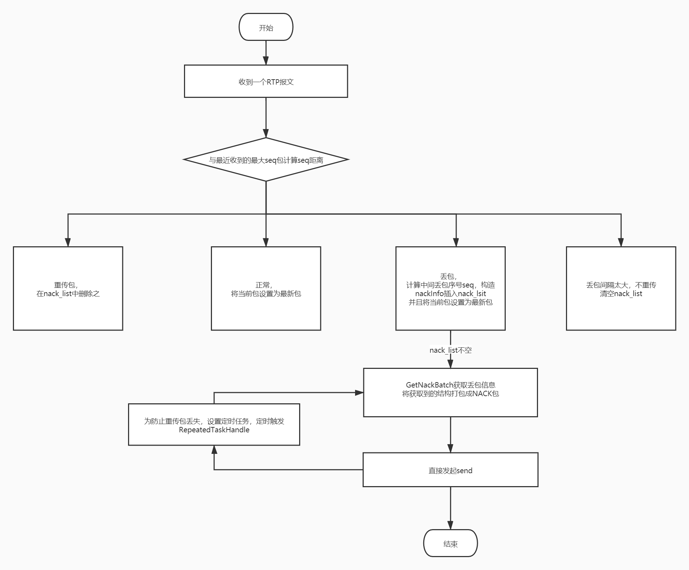

# NACK
## Nack模块相关数据结构
nack_list用于记录丢包信息 seq->nackInfo

keyframe_list_ 用于记录每次回调OnReceiverPacket的关键帧 

recover_list用于记录每次回调的RTX和FEC恢复包

## Nack 接收端触发流程
RtpVideoStreamReceiver::OnReceivedPayloadData->>NackModule2::OnReceivedPacket

首次接包 把seq更新为newest_seq_num_ 

如果seq是关键帧的话插入keyframe_list 直接return

ahead()判断last是否在seq之前 

若是则乱序 是重传包 在nack_list中删除之 并且更新keyframe_list和recover_list 返回该恢复包请求重传或恢复的次数 

若否 则是丢包 在nack_list插入中间丢失的包的seq（AddPacketsToNack中间有请求关键帧的步骤 RemovePacketsUntilKeyFrame合理请求I帧恰好能缓解丢包极其严重的问题？？）

发送重传信息：GetNackBatch得到的nack_list不空则是有丢包的情况 直接发起sendNack 同时重传的包也有可能丢所以配合定时任务RepeatedTaskHandle 每20ms重复发送NACK请求
调用链：
sendNack请求会由RtpVideoStreamReceiver::RtcpFeedbackBuffer::SendNack接管，并且会通过RtcpFeedbackBuffer::rtcp_feedback_buffer_成员变量构建请求包，RtpVideoStreamReceiver::RtcpFeedbackBuffer::SendRtcpFeedback发出

## Nack 发送端重传

若不使用PacesSender则RTPSedner::PrepareAndSendPacket进行立即重发，如果是使用 PacedSend, 则使用 PacedSender::InsertPacket 先加入发送列表中, 它的process会定时处理发送任务.
# pacedSender
一帧音频数据本身不大，不会超过以太网的最大报文长度。一个RTP报文可以搞定，按照打包时长的节奏发送就可以。但视频数据不能按照音频数据的思路发送，一帧视频可能很大，需要分别封装在几个RTP报文中，若这些视频帧RTP报文一起发送到网络上，必然会导致网络瞬间拥塞，产生丢包抖动等异常。
## 入队
音视频数据编码和RTP切分打包后，首先将RTP报文存在pace queue队列，并将报文元数据(packet id, size, timestamp, 重传标示)送到pacer queue进行排队等待发送。

可能的包类型有，音频，视频、NACK、FEC，PADDING。pace queue是一个优先级链表，报文的优先级由一个函数确认GetPriorityForType，音频>重传报文>视频和FEC>padding(为打满码率填充的包 目标是带宽探测),视频包之间由timestamp标识，越早优先级越高

调用链如下：PacedSender::EnqueuePacket函数-->PacedSenderController::EnqueuePacket按照优先级入队RoundRobinPacketQueue(多维优先级链表结构？？)

## 出队 在pacing线程处理
### 发送时间间隔确定
发送时间间隔由函数PacingController::NextSendTime控制，有两种模式kPeriodic、kDynamic，当时间到达时就会调用PacingController::ProcessPackets发包，其中kPeriodic时周期性发包 kDynamic？？

### 每个发送时发送字节的确定
当Pacing::ProcessPackets被触发时，会计算与上次发送的时间差delta_time然后传入IntervalBudget::media_buget_,再IntervalBudget::IncreaseBudget确认还可以发多少，确认的公式是：
remain bytes = delta_time * tareget_bitrate(pacer的参考码率)/8
举个例子 :

当前目标码率tareget_bitrate设置为1000kbps，假设剩余budget为100bytes，因为窗口kWindowMs=500ms，所以最大的budget限制在1000*500/8=6000bytes（budget最大窗口的好处是可以避免一次发过多的数据，超发）。
距离上次更新相隔50ms，那么budget就多了1000kbps*50/8=600bytes， 剩余100+600=700bytes；
如果当前发送一个1000bytes的报文，先判断是否有剩余budget，当前700bytes肯定有剩余，因此可以发送，并减少budget，剩余700-1000=-300bytes。

其中tareget_bitrate是由estimator由网络状态评估的

### 出队控制函数 ProcessPacket主要逻辑
根据拥塞状态以及budget是否足够，从queue中获取需要发送的报文GetPendingPacket()，可以发送则发送媒体报文，并且更新budget，否则判断是否发送padding；如果队列中数据过多，可能需要增大码率做排空处理（中间还有probing的处理）

拥塞状态：
当outstanding_data_>congestion_window_size_时拥塞
outstanding_data 的大小变化：发送报文时增加 收到对端的feedback ack（??不是只发nack吗）之后减小
congestion_window_size是由拥塞控制模块决策出的

budget：
从上面可以看到，随着时间流逝，budget增加；报文发送后budget减少。pacing根据是否有budget剩余决定是否可以发送，如果有的话从RoundRobinQueue中取最高优先级的报文发送，通过这种方式可以控制发送码率为设置的码率。

Packet发送：会调用PacketRouter::SendPacket
完成TransportSequenceNumber自增，注意rtp包的seq字段就是这里赋值的，通过报文ssrc找到合适的RtpRtcp模块去做进一步发送处理

probing:bitrate_prober.h
是一个带宽探测的机制，当budget不足时会判断是否需要发送padding包，探测发送码率，当探测到更多的带宽时，会增大tareget_bitrate，这样budget也就增大了，可以继续发送媒体包

# 参考资料
https://www.jianshu.com/p/6413cf2e8aca
https://zhuanlan.zhihu.com/p/184924220
https://blog.csdn.net/CrystalShaw/article/details/112567720